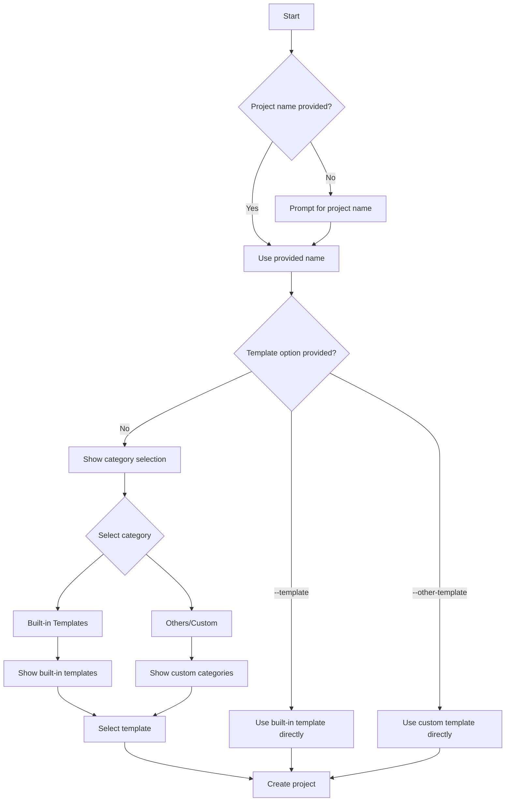

# create-make
[](https://www.npmjs.com/package/create-make) [](https://www.npmjs.com/package/create-make)
An advanced CLI tool for creating projects from GitHub repositories or custom templates with lightning-fast setup.

## ✨ Features
- ⚡ Blazing Fast: Clone templates directly from GitHub or local configs

- 🎯 Interactive TUI: Beautiful terminal interface for guided project setup

- 🔧 Custom Templates: Extend with your own templates via config file

- 🚀 Quick Mode: Skip prompts with direct CLI arguments

- 📁 Multi-Platform: Works on Windows, macOS, and Linux

- 🏗️ Template Variables: Automatic project name replacement in templates


## 📦 Installation
### Quick Use (No Installation Required)
yarn
```bash
yarn create make
```

npx
```bash
npx create-make
```

### Global Installation
yarn
```bash
yarn global add create-make
```

npm
```bash
npm install -g create-make
```


## 🚀 Quick Start
### Interactive Mode (Guided Setup)
Simply run:
```bash
yarn create make
```

You'll be guided through:

1. Project name (if not provided)

2. Category selection (Built-in types or custom)

3. Template selection from the chosen category


### Quick Mode (Skip Prompts)
Create a project with a built-in template:
```bash
yarn create make my-project --template vite-vanilla-ts
```

Create a project with a custom template:
```bash
yarn create make my-project --other-template my-custom-template
```

## 📖 CLI Reference
### Syntax
```bash
yarn create make <projectName> [options]
```

#### Arguments

| Argument | Required | Description |
|:--------:|:----:|:---------------:|
| projectName | Optional* | Name of your new project |
* Note: When using --template or --other-template, projectName is mandatory

#### Options
| Option | Alias | Description | Value Required |
|:--------:|:---:|:---------------------:|:----:|
| --template | -t | Use a built-in template (skips prompts) | Yes |
| --other-template | -o | Use a custom template from config (skips to custom selection) | Yes |
| --version | -v | Show version number | No |
| --help | -h | Show help information | No |


#### Examples
1. Full Interactive Mode
```bash
# You'll be prompted for everything
yarn create make
```

2. Project Name Only
```bash
# You'll choose category and template interactively
yarn create my-awesome-project
```

3. Quick Creation with Built-in Template
```bash
# Skips all prompts, creates immediately
yarn create my-app --template vite-node-ts
```

4. Quick Creation with Custom Template
```bash
# Skips to custom template selection
yarn create make my-project --other-template my-own-custom-template
```

5. Show Help
```bash
yarn create make --help
```


#### 🎯 Available Templates
Built-in Templates (TypeScript Category)

| Template | Description | Tech Stack |
|:--------:|:-----------------:|:----:|
| vite-vanilla-ts | Vanilla TypeScript with Vite | Vite + TypeScript |
| vite-phaser-ts | Game development with Phaser | Vite + Phaser + TypeScript |
| vite-node-ts | Node.js backend with Vite | Vite + Node.js + TypeScript |
| rollup-node-ts | Node.js with Rollup | Rollup + Node.js + TypeScript |
| vite-monorepo-ts | Monorepo setup with Vite | Vite + Monorepo + TypeScript |
| rollup-monorepo-ts | Monorepo setup with Rollup | Rollup + Monorepo + TypeScript |

__Pro Tip__: Create an alias for even faster usage! Add this to your shell config:
```bash
alias cm="yarn create make"
```
Then use:
```bash
cm my-project -t vite-node-ts
```

## ⚙️ Configuration
### Custom Templates
Add your own templates via configuration file. Custom templates appear in the "Others" category during interactive selection.

Linux:
```bash
 /home/[USER]/.local/share/create-make/config.json
```

MacOS:
```bash
 /Users/[USER]/Library/Preferences/create-make/config.json
```

Windows:
```bash
 C:\Users\[USER]\AppData\Roaming\create-make\config.json
```

#### Config File Format
Create a __config.json__ file to add your custom templates:
```json
{
  "$schema": "./schema.json",
  "categories": {
    "Backend": {
      "express-api": {
        "name": "Node Express",
        "repo": "https://github.com/username/express-template.git",
        "args": [
          {
            "str": "PROJECT_NAME",
            "value": "projectName"
          }                                     ]
      }
    },
    "Frontend": {
      "react-ts": {
        "name": "React TypeScript",
        "repo": "https://github.com/username/react-typescript-template.git",
        "args": [
          {
            "str": "APP_NAME",
            "value": "projectName"
          }
        ]
      }
    }
  }
}
```

#### Configuration Schema

| Property | Type | Description |
|:--------:|:-----------------:|:----:|
| name | string | Name of the Template  |
| repo | string | Git repository URL to clone |
| args | array | String replacements in template files |
| args[].str | string | Text in template files to replace |
| args[].value | string | Value to replace with (currently only "projectName" supported) |


## 🎮 How It Works




## 🐛 Troubleshooting
### Common Issues
#### Q: "Template not found" error
A: Ensure the template name is spelled correctly. Built-in templates are listed above. For custom templates, check your config.json.

#### Q: "Project name is required" error when using --template
A: When using --template or --other-template, you must provide the project name as the first argument.

#### Q: Custom templates not appearing
A: Verify your config.json file is in the correct location and contains valid JSON syntax.

#### Q: Tool won't run
A: Ensure you have Node.js 18+ installed. Check with node --version.


## 🤝 Contributing
### Adding New Built-in Templates
1. Fork the repository

2. Add your template to the templates directory

3. Update the template list in the code

4. Submit a pull request

## Reporting Issues
Found a bug or have a feature request? Please open an issue on [GitHub](https://github.com/z-npm/create-make/issues).
